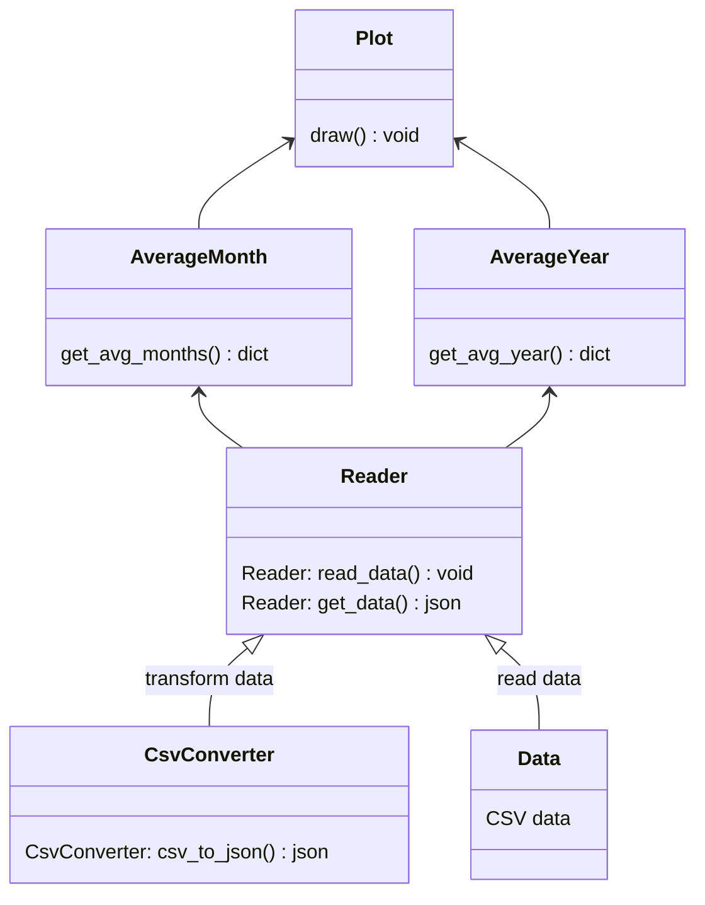

# Reader

```mermaid
classDiagram
    class Reader {
    Reader: read_data() void
    Reader: get_data() json
    } 

    class CsvConverter{
    CsvConverter: csv_to_json() json
    }

    class AverageMonth{
        get_avg_months() dict
    }

    class AverageYear{
        get_avg_year() dict
    }

    class Data{
        CSV data
    }

    class Plot{
        draw() void
    }

    Reader <|-- CsvConverter : transform data
    Reader <|-- Data : read data

    AverageMonth <-- Reader
    AverageYear <-- Reader

    Plot <-- AverageMonth
    Plot <-- AverageYear

```